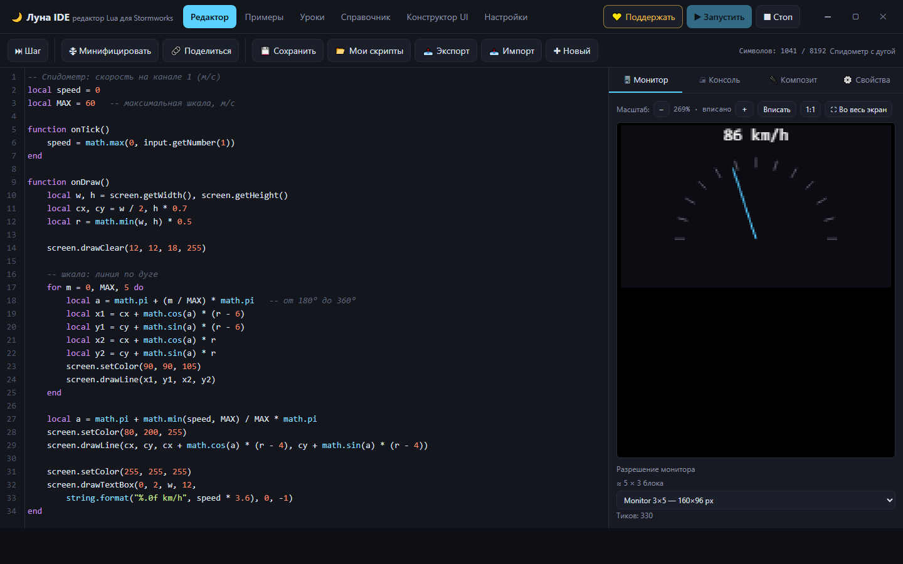

# 🌙 Луна IDE — редактор Lua для Stormworks

**Луна IDE** — русскоязычная среда для написания, запуска и отладки Lua-скриптов
для игры **Stormworks: Build and Rescue**. Разработчик — **СтаричЁк**.

Работает **полностью офлайн**. Lua-код исполняется движком Fengari (Lua 5.3,
скомпилированный в JavaScript). Есть две версии — настольная и веб.



## Скачать

| Что | Где |
|---|---|
| **Установщик для Windows** (10/11, x64, ~99 МБ) | вкладка **Releases** этого репозитория → файл `Luna-IDE-Setup.exe` |
| **Веб-версия** (любая ОС, ~0,3 МБ) | [открыть в браузере](docs/app/index.html) · или локально: `index.html` |
| **Страница проекта** | [открыть](docs/index.html) (она же — сайт GitHub Pages) |

📣 Новости, обновления и разборы скриптов — **Telegram-канал**: <https://t.me/luna_ide>

> Windows при первом запуске покажет предупреждение SmartScreen
> («Неизвестный издатель») — у программы нет платной цифровой подписи:
> «Подробнее» → «Выполнить в любом случае».

## Как запустить

### Вариант 1. Настольное приложение (Windows, рекомендуется)

Отдельное окно со своим меню, без браузера и адресной строки.

1. Установить: запустить `release\Luna-IDE-Setup-1.2.0.exe` и следовать шагам
   (без установки — `dist\Luna IDE-win32-x64\Luna IDE.exe`).
2. Ярлык **«Луна IDE»** на рабочем столе — двойной клик.
3. Напишите скрипт и нажмите **▶ Запустить** (или `F5`).

При первом запуске Windows может показать предупреждение SmartScreen
(«Неизвестный издатель») — у программы нет платной цифровой подписи:
«Подробнее» → «Выполнить в любом случае».

Меню программы: **Файл** (новый, сохранить, экспорт/импорт `.lua`), **Правка**,
**Запуск** (запустить/стоп/шаг/минифицировать), **Вид** (масштаб, полный экран, F11),
**Справка**.

### Вариант 2. Веб-версия (любая ОС)

1. Двойной клик по `index.html` (или `start.bat`).
2. Напишите скрипт и нажмите **▶ Запустить** (или `F5`).

## Сборка и публикация

```bat
npm install            :: один раз (Electron ~110 МБ + electron-builder)
npm start              :: запуск в режиме разработки
npm ci                 :: чистая установка по package-lock.json (для сборки на GitHub)

npm run installer      :: установщик      -> release\Luna-IDE-Setup-1.2.0.exe
npm run dist           :: portable-папка  -> dist\Luna IDE-win32-x64\Luna IDE.exe
npm run shots          :: скриншоты интерфейса   -> publish\shots\
npm run images         :: обложки нужных размеров
npm run release-files  :: publish\web\ и publish\itch\ (Netlify, itch.io)
npm run hosting        :: publish\hosting\ — лендинг + установщик в одной папке (РФ-хостинг)
npm run github         :: publish\github\ — готовый репозиторий для GitHub

npm run check-web      :: тест веб-версии (рисует и печатает — «OK»)
npm run check-hosting  :: тест лендинга через http:// (кнопка скачивания)
```

Готовые к публикации файлы и пошаговые инструкции (GitHub, Netlify, itch.io,
РФ-хостинг) — в [`publish/README.md`](publish/README.md).

Установщик для GitHub собирается автоматически: создайте релиз — workflow
`.github/workflows/build-release.yml` соберёт `.exe` и приложит его к релизу
(файл `Luna-IDE-Setup.exe`, чтобы ссылка на скачивание не менялась).

## Возможности

| Раздел | Что внутри |
|--------|-----------|
| **Редактор** | Подсветка синтаксиса Lua, номера строк, автоскобки, поиск/замена (`Ctrl+F`), сворачивание кода, комментарии (`Ctrl+/`) |
| **Запуск** | Реальный Lua-интерпретатор: работают `onTick()`/`onDraw()`, `input`, `output`, `property`, `screen`, `async` |
| **Монитор** | Виртуальный экран (canvas) — видно результат `onDraw()`. Реальные размеры мониторов Stormworks (1 блок = 32 px) + свой размер. Масштаб просмотра (Вписать / 1:1 / ＋ / −, колесо мыши с `Ctrl`) — **не меняет разрешение** и **запоминается отдельно для каждого разрешения**. Кнопка **«⛶ Во весь экран»**. Клик по монитору = **Q**, ПКМ = **E** (тестирование сенсорных кнопок) |
| **Консоль** | Вывод `print()` и сообщения об ошибках |
| **Композит** | Входы и выходы создаются вручную кнопкой **«＋ Добавить»**: задаёте направление, тип (число/логика), канал 1–32 и название. У входов — поле значения или галочка, у выходов — живой индикатор сигнала из скрипта |
| **Свойства** | Свойства `property.get...` с произвольными метками |
| **Минификатор** | Удаляет комментарии и лишние пробелы (сжатие кода для вставки в игру) |
| **Примеры** | 13 готовых скриптов: мигалка, кнопки, приборы, карта, ПИД и др. |
| **Уроки** | 10 пошаговых уроков: от переменных до тригонометрии приборов |
| **Справочник** | Полное описание API Stormworks и стандартной библиотеки Lua на русском |
| **Конструктор UI** | Расстановка элементов мышью → готовый код для сенсорного экрана. Выбор реального монитора из игры; настройка цветов: **фон экрана**, **цвет заливки**, **цвет текста**; у кнопок — отдельный **цвет в обычном и нажатом** состоянии. **Готовые темы** одним кликом и **копирование стиля** между элементами |

## Горячие клавиши

- `F5` / `Ctrl+Enter` — запустить скрипт
- `Ctrl+S` — сохранить (в браузере, «Мои скрипты»)
- `Ctrl+/` — закомментировать строку
- `Ctrl+F` — поиск, `Shift+Ctrl+F` — замена
- `Ctrl+Space` — автодополнение

## Сохранение и обмен

- Скрипты хранятся в браузере (кнопка **💾 Сохранить**, список — **📂 Мои скрипты**).
- **📤 Экспорт** / **📥 Импорт** — сохранение в файл `.lua` и загрузка из файла.
- **🔗 Поделиться** — ссылка, которая при открытии сразу загружает ваш код.
- **🗜 Минифицировать** — сжатие кода с сохранением смысла.

## Структура проекта

```
index.html          — интерфейс
start.bat           — запуск
favicon.png/.ico    — значок
electron-main.js    — окно настольного приложения
preload.js          — мост интерфейса и окна (свернуть/развернуть/закрыть)
js/app.js           — логика приложения
js/stormworks.js    — эмуляция API Stormworks + мост к Lua
js/minify.js        — минификатор Lua
js/uibuilder.js     — конструктор интерфейса
data/*.js           — справочник, примеры, уроки
js/libs/            — локальные библиотеки (CodeMirror, Fengari)

tools/              — служебные скрипты сборки (скриншоты, favicon, релиз)
docs/               — страница проекта для GitHub Pages (+ docs/app — веб-версия)
.github/workflows/  — автосборка установщика при создании релиза
release/            — установщик (npm run installer)
publish/            — файлы для публикации (см. publish/README.md)
LICENSE             — лицензия MIT
```

## Экранный текст — только латиницей

Шрифт Stormworks **не поддерживает кириллицу**: русский текст, нарисованный на мониторе,
превратится в «квадратики». Поэтому все надписи на экране (`screen.drawText`,
`screen.drawTextBox`, тексты кнопок в конструкторе) — на английском. Комментарии в коде
и вывод `print()` в консоль IDE можно писать по-русски.

## Важные замечания

- Это **неофициальный** инструмент, не связанный с разработчиками Stormworks.
- Имена функций API следует проверять в игре: официальная документация меняется.
- `async.httpGet` в браузере не выполняется (браузер запрещает запросы к localhost) —
  в консоль выводится предупреждение; в игре функция работает.
- Бесконечные циклы автоматически прерываются (лимит настраивается в «Настройках»).

## Лицензия

[MIT](LICENSE) — используйте, изменяйте и распространяйте свободно.
Игра Stormworks: Build and Rescue и её API принадлежат их разработчикам;
этот проект — неофициальный инструмент сообщества.

Приятной разработки! Если нужен новый пример, урок или функция — просто скажите.
